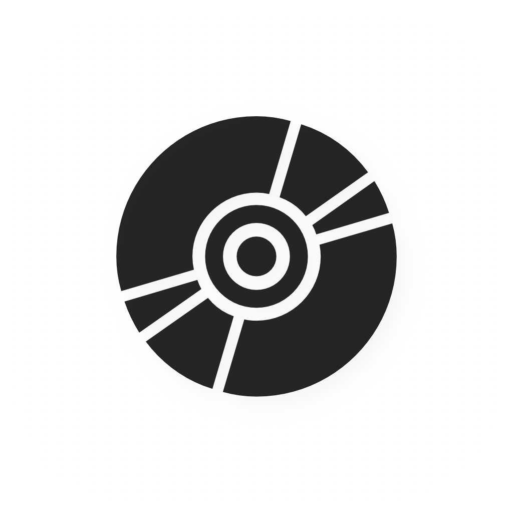
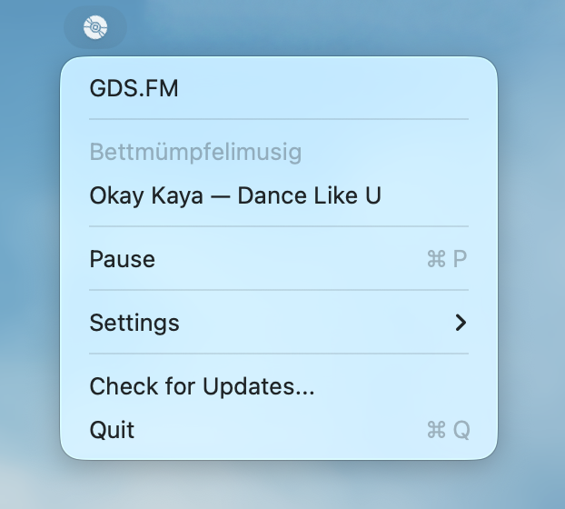

  

<h1 align="center">GDS.FM</h1>

  A macOS menubar app for streaming <a href="https://gds.fm">GDS.FM</a> radio.

  <a href="https://github.com/jorisnoo/GDSPlayer/releases/latest">Download Latest Release</a>

  

---

## Requirements

- macOS 15+ (Catalina)
- Xcode 16+

## Build

1. Open `GDSPlayer.xcodeproj` in Xcode
2. Build and run (⌘R)

For release builds, notarisation, and CI/CD setup, see [docs/BUILD.md](docs/BUILD.md).

## License

MIT
